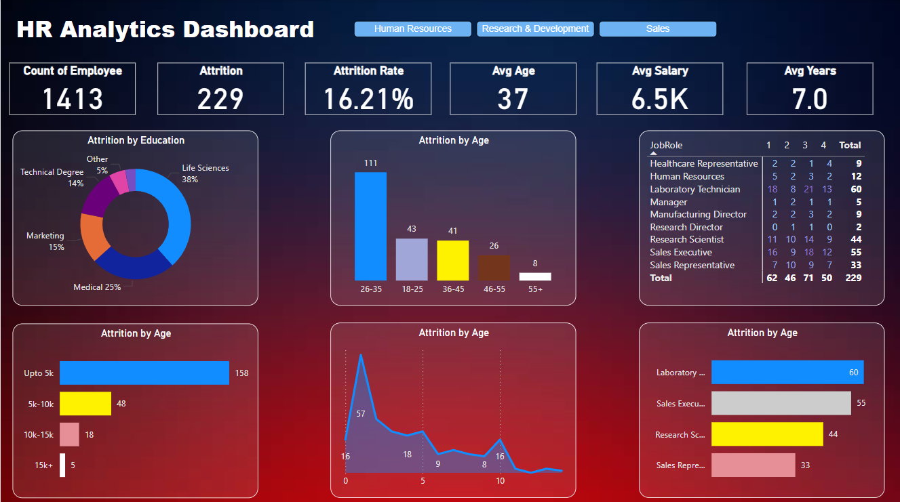

# HR Dashboard in Power BI

## Overview

This repository contains a Power BI dashboard for HR analytics. The dashboard provides insights into key HR metrics, including employee demographics, performance, attrition rates, and more. The aim is to help HR professionals make data-driven decisions to improve workforce management and organizational performance.

## Features

- **Employee Demographics:** Visualizations of employee distribution by age, gender, department, etc.
- **Performance Metrics:** Analysis of employee performance ratings and trends over time.
- **Attrition Analysis:** Insights into employee turnover rates, reasons for leaving, and patterns.
- **Recruitment Analytics:** Data on hiring trends, sources of hire, and recruitment funnel effectiveness.
- **Compensation and Benefits:** Visualization of salary distributions, benefits uptake, and related metrics.
  

## Usage

- Open the Power BI Desktop application.
- Load the `.pbix` file to view and interact with the dashboard.
- Use the filters and slicers provided to customize the view and drill down into specific data points.
- Analyze the visualizations to gain insights into various HR metrics.

## Customization

Feel free to customize the dashboard to suit your organization's specific needs. You can:
- Add or remove visualizations.
- Modify existing visualizations.
- Connect to additional data sources.
- Update the data model to include new metrics.

## Contributing

We welcome contributions to enhance the HR Dashboard. To contribute:
1. Fork the repository.
2. Create a new branch for your feature or bug fix.
3. Commit your changes and push to your branch.
4. Submit a pull request for review.
